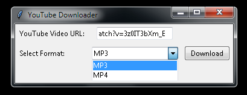

# YouTubeDownloader

YouTubeDownloader is a simple and user-friendly Python script. This script allows you to download YouTube videos in MP3 format, converting the video title into a clean file name and creating SEO-friendly file names.

29.03.2024  GUI Added!



## Installation

1. Navigate to the project directory:
    ```bash
    cd YouTubeDownloader
    ```

2. Install the required libraries:
    ```bash
    pip install -r requirements.txt
    ```

## Usage

1. Enter the YouTube video ID:
    ```bash
    python youtubeMp3Downloader.py
    ```

2. Once the download process is complete, the MP3 file will be saved in the "audios" folder.

## Example Usage

```python
# Get the YouTube video ID from the user
video_id = input("Please enter the YouTube video ID: ")

# Download audio using the YouTubeDownloader class
downloader = YouTubeDownloader(video_id)
downloader.download_audio()
